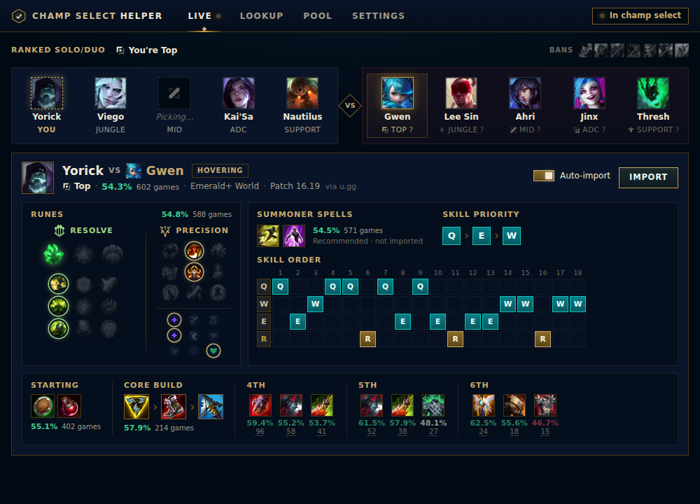
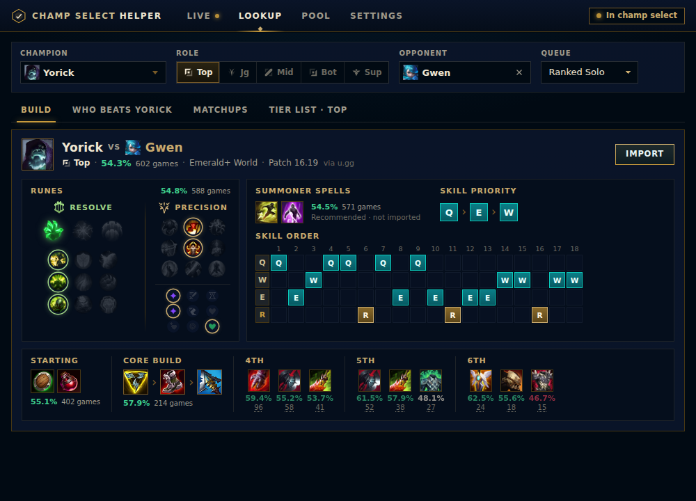

# Champ Select Helper

[](https://github.com/bsieben9-png/champ-select-helper/actions/workflows/build.yml)

A small, fast Windows app for **League of Legends champ select**. It shows
the best runes, summoner spells, items and skill order for your champion,
both in general and **for your exact lane matchup** (for example Yorick vs
Gwen), and puts them into the League client for you. When you see an enemy
champion before you've picked, it suggests easy **counter-picks**.





## What it does

- **Live champ select**: it notices when you're in champ select and follows
  your pick, your role and the enemy team, all by itself.
- **Matchup builds**: runes, summoner spells, starting items, core build,
  4th/5th/6th item options and skill order for *your champion vs your lane
  opponent*. If there isn't enough data for that matchup, it falls back to
  the champion's general build.
- **Lane opponent guessing**: League hides enemy roles in champ select, so
  the app guesses who's in your lane. If it guesses wrong, click the right
  enemy.
- **Counter-picks**: the champions with the highest win rate against an
  enemy in your role. Matchups with too few games are ignored.
- **My champion pool**: add the champions you play. Counters from your pool
  are shown first and highlighted (or, if you prefer, only your pool).
- **Import into League**: one click on **Import** creates the rune page and
  adds an in-game **item set**. (Optional: turn on auto-import in Settings
  to do it once when you lock in; it's off by default.) Summoner spells are
  only a recommendation: the app never changes them.
- **Game modes**: Ranked Solo/Duo, Ranked Flex, and Normals (Draft, Blind,
  Swiftplay, and Quickplay; these use ranked data, which has more games).
  ARAM and ARAM Mayhem are not supported.
- **Manual lookup**: look up any champion and matchup, even with League
  closed.
- **Settings**: rank filter (Emerald+ by default), region (World by
  default), minimum games for counters, and what to import.

Stats come from [u.gg](https://u.gg); champion, item and rune names and
icons come from Riot's official Data Dragon.

## Will this get me banned? Is it safe?

The app only talks to the League **client's** official local API (the same
one Blitz, Porofessor, U.GG and Mobalytics use) and never touches the game:
no memory reading, no injection, no drivers, no overlay, no keyboard or mouse
automation. It never accepts queues, picks, bans, locks in, dodges or changes
your summoner spells, and it never shows other players' names. By default it
writes nothing into the client until you click Import. Details, every League
client call it makes and Riot's rules: [docs/COMPLIANCE.md](docs/COMPLIANCE.md).

Security, antivirus and the SmartScreen warning: [docs/SECURITY.md](docs/SECURITY.md).

## Install on Windows

You need Windows 10 or 11. You also need to be **signed in to GitHub** to
download, because this repository is private.

The app is **portable**: a single `.exe`, no installer. Save it anywhere
(for example your Desktop) and double-click it.

### Option 1: from a Release (recommended)

1. Open **https://github.com/bsieben9-png/champ-select-helper/releases/latest**.
2. Under **Assets**, download **`ChampSelectHelper-vX.Y.Z-portable.exe`**.
3. Double-click it.

### Option 2: the latest build (made automatically after every change)

1. Open the repository on GitHub and click the **Actions** tab at the top.
2. In the list on the left click **Build**, then click the newest run that
   has a **green check mark**.
3. Scroll down to **Artifacts** and click **champ-select-helper-portable.exe**.
4. Builds are kept for **14 days**. After that, run a newer one or use a
   Release.

### "Windows protected your PC"

The app isn't code-signed (that costs money every year), so Windows
SmartScreen may warn you the first time you run it. Click **More info**,
then **Run anyway**. Your browser may also say the file "isn't commonly
downloaded". Choose **Keep**.

### Updating and uninstalling

- **Update**: download the new `.exe` and use it instead of the old one
  (delete the old file). Your settings are kept.
- **Uninstall**: delete the `.exe`. To remove its data too, delete the
  folders `%APPDATA%\com.bsieben9.champselecthelper` (settings) and
  `%LOCALAPPDATA%\com.bsieben9.champselecthelper` (downloaded stats). The
  app writes nothing else: no registry entries, no autostart, no services.

## Using it

1. Start Champ Select Helper. You can start it before or after League.
2. Queue up. When champ select starts, the app switches to the live view by
   itself.
3. Hover or lock your champion. The build for your matchup appears. Click
   **Import** to send the rune page and item set to the client. (If you
   turned on auto-import in Settings, that happens once, by itself, when
   you **lock in**.)
4. Rune pages and item sets made by the app start with **`CSH: `**. The app
   only ever replaces its own pages, never yours.

## Troubleshooting

**"League not detected"**
- Make sure the League client is open and you're logged in (not just the
  Riot Client).
- The app finds League by reading the small `lockfile` League writes in its
  install folder (it looks up the folder in Riot's install records, and
  falls back to `C:\Riot Games\League of Legends`). It doesn't need, and
  shouldn't be given, administrator rights.
- If it still isn't found, close the helper and start it again once League
  has fully started.

**Rune page wasn't imported ("rune page limit")**
- League limits how many custom rune pages you can have. The app replaces
  its own `CSH: ` page, but the very first time it needs a free slot. If
  every slot is full, delete one rune page in the client (or rename one so it
  starts with `CSH: `), then press **Import** again.

**Builds, counters or icons don't load**
- Check your internet connection. Firewalls and antivirus programs can block
  the app.
- Right after a new League patch, u.gg may have little data for a while. Try
  again later, or pick a broader rank filter in Settings.
- The u.gg data is **unofficial**. If u.gg changes how it works, the app can
  break until it's updated. Start a Claude Code session and ask it to check
  the u.gg data format (see `DESIGN.md`).
- To reset downloaded data, close the app and delete the folder
  `%LOCALAPPDATA%\com.bsieben9.champselecthelper` (paste that into the File
  Explorer address bar). Settings are stored separately in
  `%APPDATA%\com.bsieben9.champselecthelper\settings.json`.

**Windows won't start the app**
- See ["Windows protected your PC"](#windows-protected-your-pc) above.
- The app needs **Microsoft Edge WebView2**, which Windows 10/11 already
  include. If it's missing, get it from
  [Microsoft](https://developer.microsoft.com/microsoft-edge/webview2/).

## Develop on your Windows PC with Claude Code

### One-time setup

Install these, in this order, and accept the default options unless noted:

1. **Git for Windows**: <https://git-scm.com/download/win>
2. **Node.js 22 LTS**: <https://nodejs.org/en/download>. Pick version 22.
3. **Visual Studio Build Tools**:
   <https://visualstudio.microsoft.com/visual-cpp-build-tools/>. In the
   installer, tick the **"Desktop development with C++"** workload, then
   click Install. Rust needs it to build Windows programs.
4. **Rust**: <https://rustup.rs>. Download and run `rustup-init.exe` and
   choose the default installation (it uses the **MSVC** toolchain, which is
   what we want).
5. **WebView2**: already part of Windows 10/11, nothing to do.
6. **Claude Code**, if you don't have it yet.

Then open a **new** terminal (PowerShell, or "Git Bash") so it picks up the
new programs, and run:

```sh
git clone https://github.com/bsieben9-png/champ-select-helper
cd champ-select-helper
npm install
npm run tauri dev
```

The first `npm run tauri dev` compiles everything and takes several
minutes. After that it starts in seconds. The app window opens, and changes
to the UI show up live.

To work with Claude, run this in the same folder:

```sh
claude
```

Claude reads `CLAUDE.md` (project notes and status) and `DESIGN.md` (how
everything works) automatically, so you can just say what you want.

### Useful commands

| Command | What it does |
|---|---|
| `npm run tauri dev` | Run the app while developing |
| `npm run dev` | Only the UI, in your web browser, with fake data (no Rust or League needed) |
| `npm run check` | Check the UI code for mistakes |
| `cd src-tauri` then `cargo test` | Run the backend tests |
| `npm run tauri build -- --no-bundle` | Build the portable app: `src-tauri\target\release\champ-select-helper.exe` |

## Switching between your PC and the cloud

You work in three places: your **PC**, **Claude Code cloud sessions**, and
the **GitHub website**. GitHub is the meeting point, so:

- **When you start** working on the PC, get the latest changes:
  ```sh
  git pull
  ```
- **When you stop**, save your work to GitHub. The easiest way is to tell
  Claude: *"Update the status section in CLAUDE.md, then commit and push."*
  Or do it yourself:
  ```sh
  git add -A
  git commit -m "Describe what you changed"
  git push
  ```
- **Cloud sessions** push their work to GitHub themselves, often to a
  separate branch with a **pull request**. On GitHub, open **Pull requests**,
  open it and click **Merge pull request**, then `git pull` on your PC.
- Cloud sessions set themselves up automatically (system libraries, npm
  packages and Rust crates) using `.claude/hooks/session-start.sh`, so Claude
  can build and test right away.
- The **"Status / where we left off"** section at the bottom of `CLAUDE.md`
  is the hand-off note between sessions. Keep it up to date, and the next
  session (on any machine) knows what's done and what's next.

## Automatic builds and releases

- Every push to `main` and every pull request runs the **Build** workflow
  (`.github/workflows/build.yml`). It checks and tests the code on Linux and
  builds the Windows app. You can also start it by hand: **Actions → Build →
  Run workflow**.
- Changes that only touch text (README, `docs/`, `CLAUDE.md`) don't start a
  build, to save GitHub's free monthly build minutes. Windows builds use
  them up faster than Linux ones.
- **Releases** (permanent downloads with a version number) are made by the
  **Release** workflow. See [docs/RELEASING.md](docs/RELEASING.md).

## How it works (short version)

The app reads the League client's local connection details from League's
`lockfile`, asks the client about champ select about once a second (every
5 seconds on the home screen and in game), fetches stats from u.gg (cached
on disk per patch) and pushes a rune page and an item set back through the
client's local API. Details, data formats and decisions are in
[DESIGN.md](DESIGN.md).

## Disclaimers

Champ Select Helper isn't endorsed by Riot Games and doesn't reflect the
views or opinions of Riot Games or anyone officially involved in producing
or managing Riot Games properties. Riot Games, and all associated
properties are trademarks or registered trademarks of Riot Games, Inc.

Champ Select Helper is not affiliated with u.gg. It reads u.gg's
**unofficial** data, which isn't a public API and may stop working
whenever u.gg changes its website. This is a personal project for
personal use.
